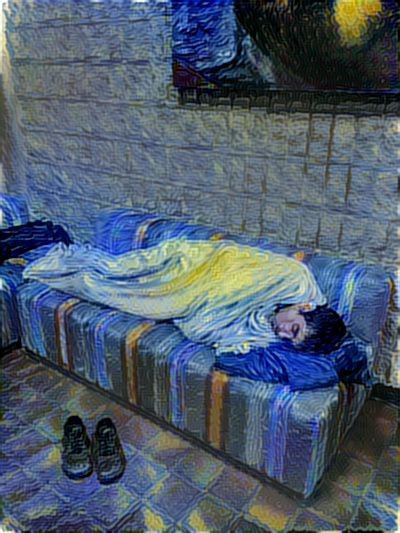
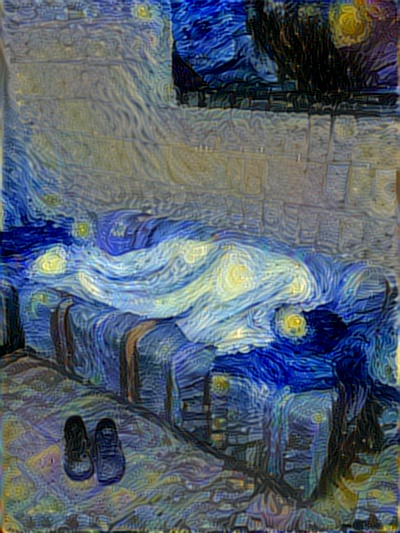
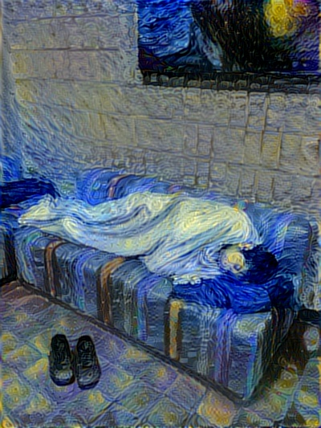
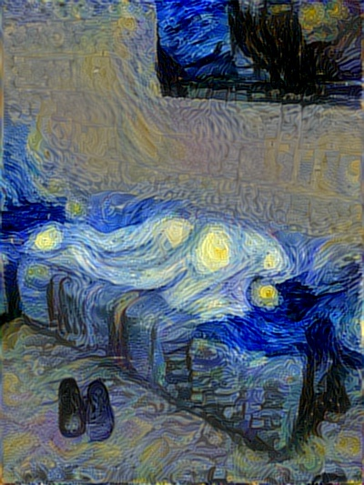
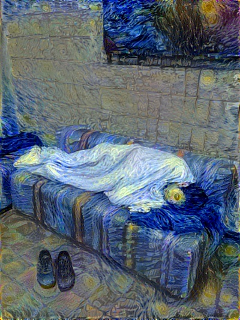
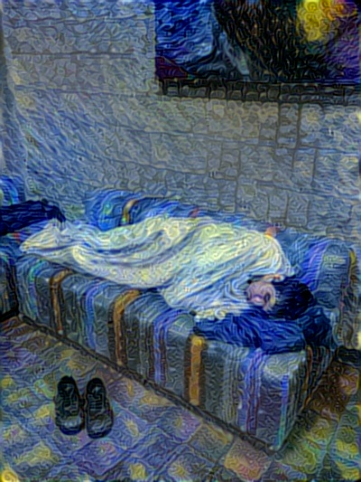
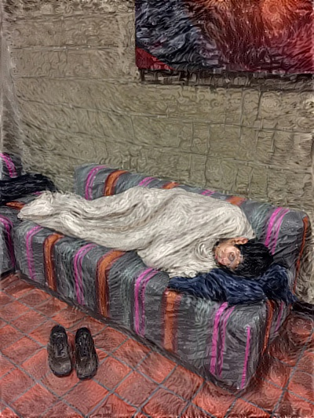

# neural-style

An implementation of [neural style][paper] in TensorFlow.

This implementation is a lot simpler than a lot of the other ones out there,
thanks to TensorFlow's really nice API and [automatic differentiation][ad].

TensorFlow doesn't support [L-BFGS][l-bfgs] (which is what the original authors
used) directly, so this implementation uses [TF External Optimizer][tf_ext_optimizer]
(examples on how to use it could be found [here][tf_ext_optimizer_test] and
[here][tf_ext_optimizer_test]) to utilize L-BFGS and CG optimizers. Using TF's [Adam][adam]
optimizer is also an option, although this may require a little bit more hyperparameter
tuning to get nice results. In order to specify which optimizer to use, `--optim`
command line argument, e.g. `--optim cg` if you want to use CG optimizer.

Be careful with checkpoints (see below) when using CG or L-BFGS, as each checkpoint
splits the optimization procedure, which might negatively affect the convergence.

**See [here][lengstrom-fast-style-transfer] for an implementation of [fast
(feed-forward) neural style][fast-neural-style] in TensorFlow.**

## Examples

Here's a typical style transfer, most popular content (cat) + most popular style ("Starry Night"
by Vincent van Gogh):


## Improvements

Some improvements of this implementation over vanilla ["A Neural Algorithm of Artistic Style"][paper_arxiv] paper:
* Hierarchical style transfer (see `--max-hierarchy`)
* Default VGG network topology as well as smaller SqueezeNet v1.1 backend (use `--network-type` to switch), see detail on SqueezeNet below
* Adjustable inter-layer weights (see `--style-layer-weight-exp`)
* Adjustable pooling (use `--pooling`)
* Color-preserving style transfer (either in YUV or HSV spaces, see `--preserve-colors` and additional script `luma_transfer.py`)
* More layers to extract content and style from
* Activation shift (see `--ashift`), comes from [Improving the Neural Algorithm of Artistic Style][improv_paper_arxiv]

Original (base) implementation of TF style transfer introduced styles blending.
This implementation also has an option of switching between L-BFGS/CG/Adam optimizers.

## SqueezeNet

You can select alternative style transfer backend (feature extractor) - SqueezeNet v1.1. Since the pre-trained model is very small (~5MB full, and ~3MB without classifier) - repository includes pre-trained weights without the classifier. If you want to get the full pre-trained weights - you can follow to the [TF SqueezeNet repository][tf_squeezenet] that has the converted TensorFlow SqueezeNet (conversion was done specifically for this project, but the classifier was added for the separate repository).

Using SqueezeNet backend sometimes results in observable quality drop versus the VGG19 backend, but SqueezeNet offers about 2x decrease in optimization iteration time and about 2x decrease in GPU memory consumption, so this could be a feasible tradeoff, especially given the pretrained model is that small.

Example pictures:


(**left**: VGG19; **right**: SqueezeNet v1.1)

## Extras

In addition, this implementation offers some improvements that are not directly related to the optimization-based style transfer, but one might find them somewhat useful.

### Color-preserving style transfer

In the ["Preserving Color in Neural Artistic Style Transfer" paper][preserve_paper_arxiv], Gatys et al. suggest several ways of keeping original colors from the content image on the resulting stylized image. This version of neural style transfer implements simplest approach of luminance transfer, and does this in two ways. First is simple luminance transfer (color channels from the YCbCr transform of content image into stylized image), and another one is hue transfer (hue channel from the HSV transform of content image, plus min of saturations to avoid oversaturation) - all done as post-process after the style transfer. The code is in `luma_transfer.py` script, this scrip also could be used as a standalone script, which takes stylized and content images as inputs. Supports collages (see below).

### Collage building

Collages are convenient way to view style transfer results. Collages are built automatically, but you can disable that with `--no-collage` command line argument of the `neural_style.py` script. The code for building collages are in the `build_collage.py`, could also be used as a standalone script, which builds collage from stylized, content and style images, given that the stylized image filename is auto-generated.

## Running

`python neural_style.py --content <content file> --styles <style file> --output <output file>`

Run `python neural_style.py --help` to see a list of all options.

Use `--checkpoint-output` and `--checkpoint-iterations` to save checkpoint images.

Use `--iterations` to change the number of iterations (default 1000).  For a 512×512 pixel content file, 1000 iterations take 2.5 minutes on a GeForce GTX Titan X GPU, or 90 minutes on an Intel Core i7-5930K CPU.

## Tweaking

`--style-layer-weight-exp` command line argument could be used to tweak how "abstract"
the style transfer should be. Lower values mean that style transfer of a finer features
will be favored over style transfer of a more coarse features, and vice versa. Default
value is 1.0 - all layers treated equally. Somewhat extreme examples of what you can achieve:




(**left**: 0.2 - finer features style transfer; **right**: 2.0 - coarser features style trasnfer)

`--content-weight-blend` specifies the coefficient of content transfer layers. Default value -
1.0, style transfer tries to preserve finer grain content details. The value should be
in range [0.0; 1.0].




(**left**: 1.0 - default value; **right**: 0.1 - more abstract picture)

`--pooling` allows to select which pooling layers to use (specify either `max` or `avg`).
Original VGG topology uses max pooling, but the [style transfer paper][paper] suggests
replacing it with average pooling. The outputs are perceptually differnt, max pool in
general tends to have finer detail style trasnfer, but could have troubles at
lower-freqency detail level:




(**left**: max pooling; **right**: average pooling)

`--preserve-colors` boolean command line argument adds post-processing step, which
combines colors from the original image and luma from the stylized image (YCbCr color
space), thus producing color-preserving style trasnfer:




(**left**: original stylized image; **right**: color-preserving style transfer)

## Requirements

* [TensorFlow](https://www.tensorflow.org/versions/master/get_started/os_setup.html#download-and-setup)
* [NumPy](https://github.com/numpy/numpy/blob/master/INSTALL.rst.txt)
* [SciPy](https://github.com/scipy/scipy/blob/master/INSTALL.rst.txt)
* [Pillow](http://pillow.readthedocs.io/en/3.3.x/installation.html#installation)
* [Pre-trained VGG network][net] (MD5 `8ee3263992981a1d26e73b3ca028a123`) - put it in the top level of this repository, or specify its location using the `--network` option.

## Citation

If you use this implementation in your work, please cite the following:

```
@misc{avoroshilov2017neuralstyle,
  author = {Andrey Voroshilov, Anish Athalye},
  title = {Neural Style},
  year = {2017},
  howpublished = {\url{https://github.com/avoroshilov/neural-style/tree/dev}},
  note = {commit xxxxxxx}
}
```

## License

Copyright (c) 2017 Andrey Voroshilov, 2015-2016 Anish Athalye. Released under GPLv3. See
[LICENSE.txt][license] for details.

[net]: http://www.vlfeat.org/matconvnet/models/beta16/imagenet-vgg-verydeep-19.mat
[paper]: http://arxiv.org/pdf/1508.06576v2.pdf
[paper_arxiv]: https://arxiv.org/abs/1508.06576
[improv_paper_arxiv]: https://arxiv.org/abs/1605.04603
[preserve_paper_arxiv]: https://arxiv.org/abs/1606.05897
[l-bfgs]: https://en.wikipedia.org/wiki/Limited-memory_BFGS
[adam]: http://arxiv.org/abs/1412.6980
[ad]: https://en.wikipedia.org/wiki/Automatic_differentiation
[lengstrom-fast-style-transfer]: https://github.com/lengstrom/fast-style-transfer
[fast-neural-style]: https://arxiv.org/pdf/1603.08155v1.pdf
[license]: LICENSE.txt
[tf_ext_optimizer]: https://github.com/tensorflow/tensorflow/blob/master/tensorflow/contrib/opt/python/training/external_optimizer.py
[tf_ext_optimizer_test]: https://github.com/tensorflow/tensorflow/blob/master/tensorflow/contrib/opt/python/training/external_optimizer_test.py
[tf_ext_optimizer_help]: https://www.tensorflow.org/versions/r1.0/api_docs/python/contrib.opt/other_functions_and_classes#ScipyOptimizerInterface
[tf_squeezenet]: https://github.com/avoroshilov/tf-squeezenet
