# neural-style

An implementation of [neural style][paper] in TensorFlow. Windows instructions to set up the environment are available in [RUN_WIN.md](RUN_WIN.md).

This implementation is a lot simpler than a lot of the other ones out there,
thanks to TensorFlow's really nice API and [automatic differentiation][ad].

TensorFlow doesn't support [L-BFGS][l-bfgs] (which is what the original authors
used) directly, so this implementation uses [TF External Optimizer][tf_ext_optimizer]
(examples on how to use it could be found [here][tf_ext_optimizer_test] and
[here][tf_ext_optimizer_test]) to utilize L-BFGS and CG optimizers. Using TF's [Adam][adam]
optimizer is also an option, although this may require a little bit more hyperparameter
tuning to get nice results. In order to specify which optimizer to use, `--optim`
command line argument, e.g. `--optim cg` if you want to use CG optimizer.

Be careful with checkpoints (see below) when using CG or L-BFGS, as each checkpoint
splits the optimization procedure, which might negatively affect the convergence.

**See [here][lengstrom-fast-style-transfer] for an implementation of [fast
(feed-forward) neural style][fast-neural-style] in TensorFlow.**

## Examples

Here's a typical style transfer, most popular content (cat) + most popular style
("Starry Night" by Vincent van Gogh):


The collage is built automatically using `build_collage.py`, see [collage building](#collage-building) section.

All example stylized pictures here are about the same size, you can view bigger versions by clicking on them, and original-sized images in `examples` folder.

## Improvements

Some improvements of this implementation over vanilla ["A Neural Algorithm of Artistic Style"][paper_arxiv] paper:
* Hierarchical style transfer (see `--max-hierarchy`), see [Hierarchical style transfer section](#hierarchical-style-transfer) below
* Default VGG network topology as well as smaller SqueezeNet v1.1 backend (use `--network-type` to switch), see details in [SqueezeNet section](#squeezenet) below
* Adjustable inter-layer weights (see `--style-layer-weight-exp`)
* Adjustable pooling (use `--pooling`)
* Color-preserving style transfer (a lot of various options, see `--preserve-colors` and additional script `luma_transfer.py`, details in [Color-preserving style transfer](#color-preserving-style-transfer) section)
* More layers to extract content and style from
* Activation shift (see `--ashift`), comes from [Improving the Neural Algorithm of Artistic Style][improv_paper_arxiv]; details in [Perceptual convergence](#perceptual-convergence)
* Different style feature extraction, in addition to Gram matrices calculation, see [Style feature extraction section](#style-feature-extraction)
* Distribution remapping loss, based on the idea of histogram loss from [Stable and Controllable Neural Texture Synthesis and Style Transfer Using Histogram Losses][histloss_paper_arxiv]; details in [Perceptual convergence](#perceptual-convergence)

Original (base) implementation of TF style transfer introduced styles blending.
This implementation also has an option of switching between L-BFGS/CG/Adam optimizers.

## Hierarchical style transfer

To improve low frequency features style transfer quality, as well as decrease time required
to transfer style for a single image (esp. big image) - hierarchical style transfer was
introduced.

First, the style transfer happens at the lowest possible scale - the amount of
downscaling steps is determined by `--max-hierarchy` command line setting or by the amount
of downscaling steps needed for the smallest image to reach certain dimension size. In order
to get vanilla style transfer, use `--max-hierarchy 1`.

Then, the output - smallest stylized image - is upscaled, blended in with some white noise
(if specified), and gets fed into the next hierarchical step as the initial guess.

Example:


## SqueezeNet

You can select alternative style transfer backend (feature extractor) - SqueezeNet v1.1.
Since the pre-trained model is very small (~5MB full, and ~3MB without classifier) -
repository includes pre-trained weights without the classifier. If you want to get the
full pre-trained weights - you can follow to the [TF SqueezeNet repository][tf_squeezenet]
that has the converted TensorFlow SqueezeNet (conversion was done specifically for this
project, but the classifier was added for the separate repository).

Using SqueezeNet backend sometimes results in observable quality drop versus the VGG19 backend,
but SqueezeNet offers about 2x decrease in optimization iteration time and about 2x decrease in
GPU memory consumption, so this could be a feasible tradeoff, especially given the pretrained
model is that small.

In order to select between backends, use `--network-type vgg` for VGG19 backend, or
`--network-type sqz` for SqueezeNet v1.1 backend.

Example pictures:

 

(**left**: VGG19; **right**: SqueezeNet v1.1)

## Style feature extraction

By default, style loss function is calculated based on the Gram matrices of the layer activation maps,
as it is described in the original paper. However there are alternative approaches, one of which was
mentioned in various texture model papers, as well as described by Justin Johnson ([jcjohnson](https://github.com/jcjohnson))
in one of the CS231n Stanford lectures. Instead of calculating 2D Gram matrices, one can calculate 1D
vector of mean across activation map, and then use that to calculate the style loss function. This
requires less calculation, although gives worse (or, rather, quite different) results.

Yet another way to match style would be to match not only mean activations, but mean activations and
standard deviation of the feature maps. This is slightly slower than just mean activations, but
significantly faster than Gram matrices matching, and the result is only slightly different from the latter.

Further details on different style loss functions could be found in [Demystifying Neural Style Transfer][demyst_paper_arxiv].

This is an example of how would that alternative extraction look like, in comparison (both use VGG backends):

 


(**left**: mean activation map based style loss [1.25x]; **right**: (mean + std dev) activation map based style loss [1.2x]; **bottom**: Gram matrix based style loss [1.0x])

Generally, the mean activation alternative is ~20% faster, but (probably subjectively) produces
slightly worse results than the default Gram-based style loss. The full distribution matching is
~15% faster than Gram-based style loss, but also produces much closer results than just mean
activation.

## Perceptual convergence

Naïve style transfer can sometimes give poor results, and this problem is well described in
[Stable and Controllable Neural Texture Synthesis and Style Transfer Using Histogram Losses][histloss_paper_arxiv]
paper. In the paper, it is suggested to introduce additional style loss function, based on
histogram remapping of the feature activation maps. In this implementation of the style transfer,
similar idea is used, but the key difference is that instead of more complicated histogram
matching, simpler full distribution (mean, std dev) matching is used to remap feature map
activations.

In the examples below, style transfer of the "Gibraltar by Night" by Ivan Aivazovsky was
performed on the same cat image. The "Starry Night" transfers very easily to nearly any content
image, so another style had to be chosen in order to illustrate the problem. Additionally, style
transfer options were tweaked, so that naïve style transfer had obvious artifacts. All style
transfer options are kept same for all the example images below (except activation shift and
distribution loss, of course):

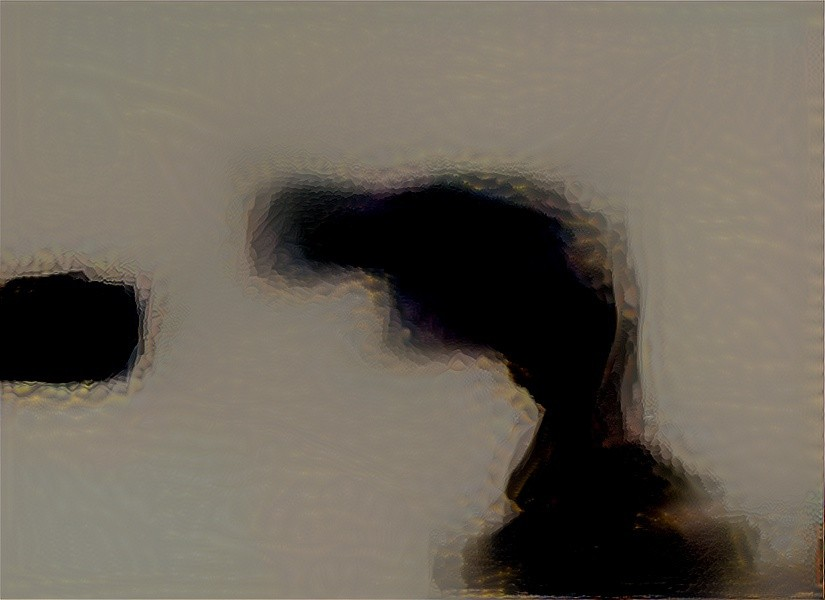 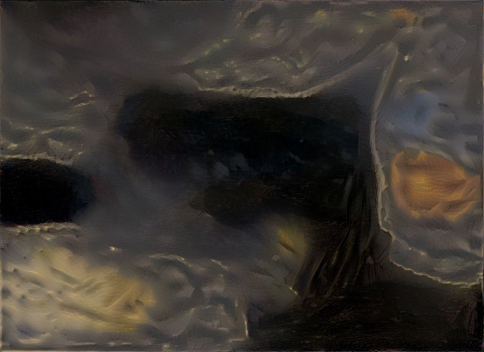
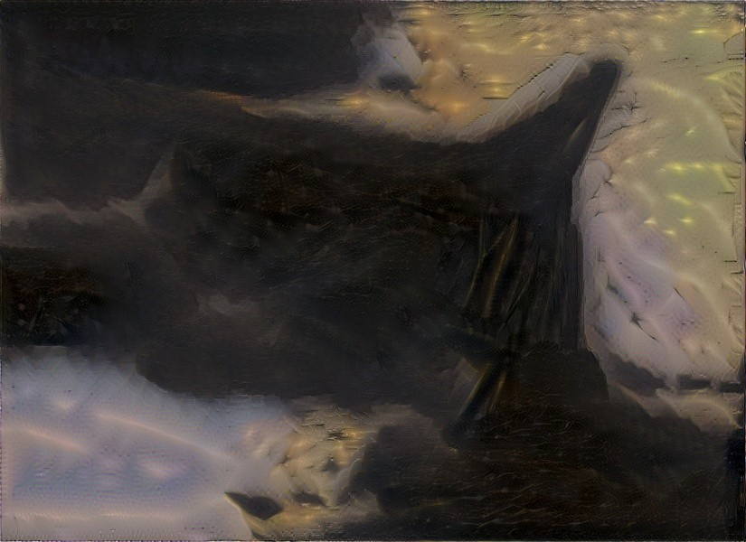 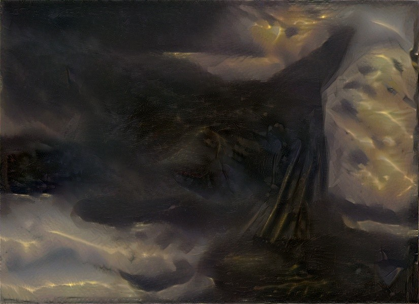

(**top-left**: naïve style transfer; **top-right**: naïve style transfer with activation shift 100; **bottom-left**: naïve style transfer with additional distribution remapping loss; **bottom-right**: both distribution remapping loss and activation shift)

As it could be seen from these examples, naïve style transfer produces quite poor results for
this set of parameters. Then, by adding activation shift alone, results could be improved substantially.
Introducing distribution remapping loss **instead** of activation shift gives somewhat similar
results to the activation shift alone, but what gives the best picture is a combination of both
the activation shift and the distribution remapping loss added to the style transfer.

Performance-wise, however, activation shift has nearly no overhead, while additional distribution remapping loss could add another 10%-15% to style transfer time. This example of transferring Aivazovsky's style was a particularly complex one, in most cases activation shift is enough; so it is advised to use activation shift by default, and in certain cases additionally enable distribution remapping loss.

## Extras

In addition, this implementation offers some improvements that are not directly related to the optimization-based style transfer, but one might find them somewhat useful.

### Color-preserving style transfer

In the ["Preserving Color in Neural Artistic Style Transfer" paper][preserve_paper_arxiv], Gatys
et al. suggest several ways of keeping original colors from the content image on the resulting
stylized image. This version of neural style transfer implements simplest approach of luminance
transfer, and does this in two ways. First - is simple luminance transfer (color channels from
the YCbCr transform of content image into stylized image), and another one is hue transfer (hue
channel from the HSV transform of content image, plus min of saturations to avoid oversaturation) -
all done as post-process after the style transfer. Currently, the second way of color-preserving
style transfer only available in a standalone script, as there is no mode selection command line
argument in `neural_style.py`.

The code is in `luma_transfer.py` script, this scrip also could be used as a standalone script,
which takes stylized and content images as inputs (color preserving post-processing doesn't require
style transfer run if you already have stylized images). In standalone script, you can select mode
by specifying either `--mode yuv` or `--mode hsv`. Supports collages (see below).


 

(**left**: YCbCr luma transfer; **right**: HSV Saturation+Value transfer)

As can be seen in the example, the YCbCr much more resembles the original photo, but HSV keeps more from the style transfer itself.

### Color transfer with strong stylistic distortions

Here's an example, where content was deliberately omitted during the style transfer, and the result of YCbCr post-stylize color transfer:

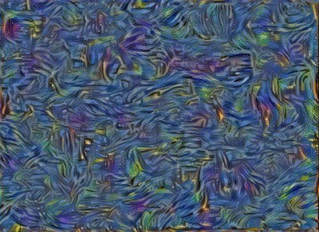 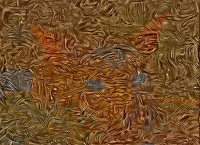

(**left**: original contentless style transfer; **right**: YCbCr color transfer)

It is easily noticeable, that straightforward post-stylize color transfer in any space causes the original object to show up, even though the stylized image had no resemblanse with it. This is artificial example, but in the real world style transfercould introduce distortions that will create discrepancies during the color transfer. There are couple of ways to fix this.

First is to match color distribution, rather than transfer colors pixel-by-pixel - and two basic ways of doing so are the distribution matching, and the histogram matching. The distribution matching is simple linear color remapping, where source image is first offset by the mean color (to center color distribution around 0), then scaled by the relation of std devs of target color distribuiotn to ource color distribuiotn, and then shifted from 0 to the mean target color distribution.
Histogram matching is more complicated problem which includes mapping to the cumulative distribution, and then back from it, using histograms of both source and target images. However, practically, much simpler distribution matching may work out quite well.

Below are examples of post-stylize histogram matching in various color spaces:

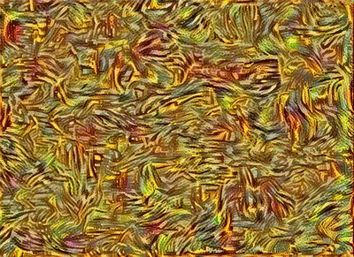 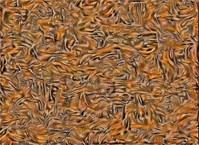

(**left**: histogram matching in RGB space; **right**: histogram matching in HSV space)

### Color transfer to the style image

And the second approach is to transfer color to the style image(s) prior to the style transfer. This gives perceptually the best results, and copes with stylistic distortionns naturally.

Below are couple examples of **style** images with color transferred prior to the style transfer:

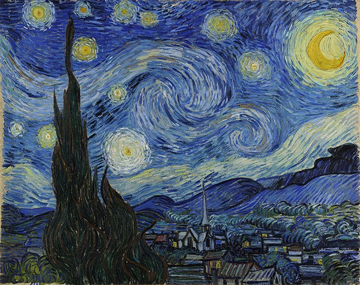 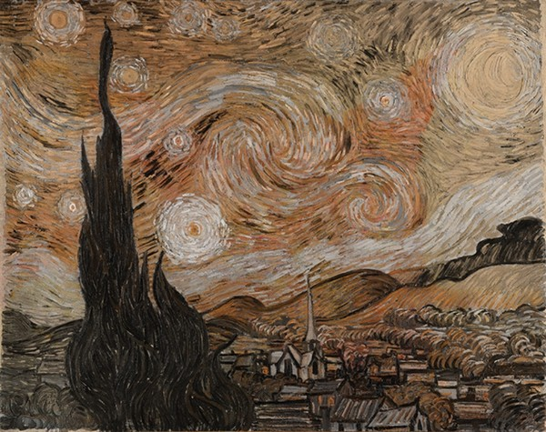
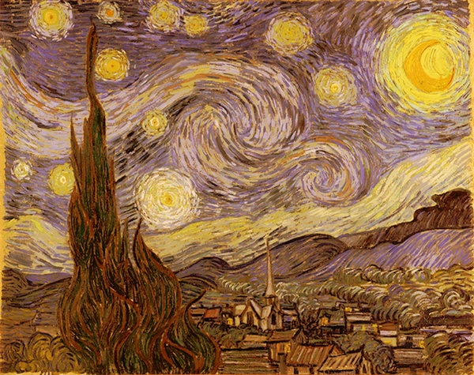 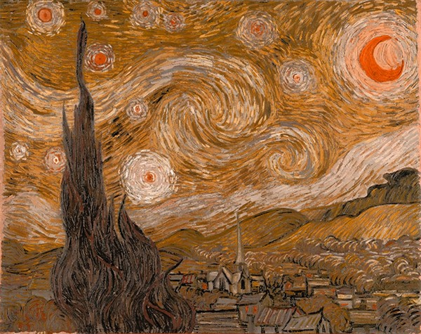

(**top-left**: original "Starry Night" by Vincent Van Gogh; **top-right**: straightforward HSV color transfer, with minimal saturation selection; **bottom-left**: histogram matching in RGB space; **bottom-right**: histogram matching in HSV space)

On the straightforward HSV color transfer example, content is present in the style image, but it doesn't interfere with the style transfer in any way, according to our observations.

### Collage building

Collages are convenient way to view style transfer results. Collages are built automatically, but
you can disable that with `--no-collage` command line argument of the `neural_style.py` script. The
code for building collages are in the `build_collage.py`, could also be used as a standalone script,
which builds collage from stylized, content and style images, given that the stylized image filename
is auto-generated.

An example of such collage is the first image of this README file.

## Running

`python neural_style.py --content <content file> --styles <style file> --output <output file>`

It is not necessary to specify output filename via `--output`, as if this parameter is omitted,
the script will generate one automatically, using the following format:
`t_<content filename>_<style filename>_<transfer parameters>.jpg`
and scripts such as `luma_transfer.py` or `build_collages.py` expect stylized images fed into them
in similar format, so that they could automatically infer content image filename or style image
filename, if it is required.

Run `python neural_style.py --help` to see a list of all options.

Use `--checkpoint-output` and `--checkpoint-iterations` to save checkpoint images.

Use `--iterations` to change the number of iterations (default 1000).  For a 512×512 pixel content file,
1000 Adam iterations take 2.5 minutes on a GeForce GTX Titan X GPU, or 90 minutes on an Intel Core i7-5930K CPU.

## Tweaking

`--style-layer-weight-exp` command line argument could be used to tweak how "abstract"
the style transfer should be. Lower values mean that style transfer of a finer features
will be favored over style transfer of a more coarse features, and vice versa. Default
value is 1.0 - all layers treated equally.

`--content-weight-blend` specifies the coefficient of content transfer layers. Default value -
1.0, style transfer tries to preserve finer grain content details. The value should be
in range [0.0; 1.0].

`--pooling` allows to select which pooling layers to use (specify either `max` or `avg`).
Original VGG topology uses max pooling, but the [style transfer paper][paper] suggests
replacing it with average pooling. The outputs are perceptually different, max pool in
general tends to have finer detail style transfer, but could have troubles at
lower-frequency detail level. When using hierarchical style transfer, you can safely use
average pooling in almost any case.

`--ashift` is a command line argument which allows to tweak activation shift, a technique
described in [Improving the Neural Algorithm of Artistic Style][improv_paper_arxiv] paper.
Experiments show, that quite big range of values could be used there, e.g. for abstract,
style-heavy transfer, it was useful sometimes to set it to 1000; although in some cases it
could produce artifacts - so a safe point for abstract style transfer would be value in range
50-100. For content-heavy style transfer, smaller values (and sometimes, negative) could be
useful.

Example of different tweaks applied to the same content/style image pair (cat+"Starry Night"):

 

(**left**: content-heavy transfer; **right**: style-heavy transfer)


## Requirements

* [TensorFlow](https://www.tensorflow.org/versions/master/get_started/os_setup.html#download-and-setup)
* [NumPy](https://github.com/numpy/numpy/blob/master/INSTALL.rst.txt)
* [SciPy](https://github.com/scipy/scipy/blob/master/INSTALL.rst.txt)
* [Pillow](http://pillow.readthedocs.io/en/3.3.x/installation.html#installation)
* [Pre-trained VGG network][net] (MD5 `8ee3263992981a1d26e73b3ca028a123`) - put it in the top level of this repository, or specify its location using the `--network-file` option.<br />
(Not required if SqueezeNet v1.1 backend is used for style transfer).

## Citation

If you use this implementation in your work, please cite the following:

```
@misc{avoroshilov2017neuralstyle,
  author = {Andrey Voroshilov, Anish Athalye},
  title = {Neural Style},
  year = {2017},
  howpublished = {\url{https://github.com/avoroshilov/neural-style/tree/dev}},
  note = {commit xxxxxxx}
}
```

## License

Copyright (c) 2017 Andrey Voroshilov, 2015-2016 Anish Athalye. Released under GPLv3. See
[LICENSE.txt][license] for details.

[net]: http://www.vlfeat.org/matconvnet/models/beta16/imagenet-vgg-verydeep-19.mat
[paper]: http://arxiv.org/pdf/1508.06576v2.pdf
[paper_arxiv]: https://arxiv.org/abs/1508.06576
[improv_paper_arxiv]: https://arxiv.org/abs/1605.04603
[preserve_paper_arxiv]: https://arxiv.org/abs/1606.05897
[demyst_paper_arxiv]: https://arxiv.org/abs/1701.01036
[histloss_paper_arxiv]: https://arxiv.org/abs/1701.08893
[l-bfgs]: https://en.wikipedia.org/wiki/Limited-memory_BFGS
[adam]: http://arxiv.org/abs/1412.6980
[ad]: https://en.wikipedia.org/wiki/Automatic_differentiation
[lengstrom-fast-style-transfer]: https://github.com/lengstrom/fast-style-transfer
[fast-neural-style]: https://arxiv.org/pdf/1603.08155v1.pdf
[license]: LICENSE.txt
[tf_ext_optimizer]: https://github.com/tensorflow/tensorflow/blob/master/tensorflow/contrib/opt/python/training/external_optimizer.py
[tf_ext_optimizer_test]: https://github.com/tensorflow/tensorflow/blob/master/tensorflow/contrib/opt/python/training/external_optimizer_test.py
[tf_ext_optimizer_help]: https://www.tensorflow.org/versions/r1.0/api_docs/python/contrib.opt/other_functions_and_classes#ScipyOptimizerInterface
[tf_squeezenet]: https://github.com/avoroshilov/tf-squeezenet
